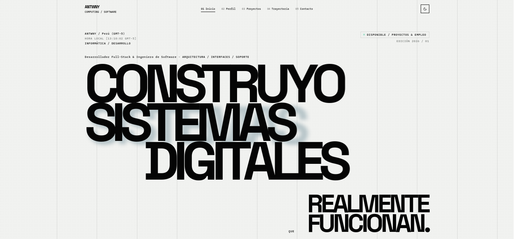
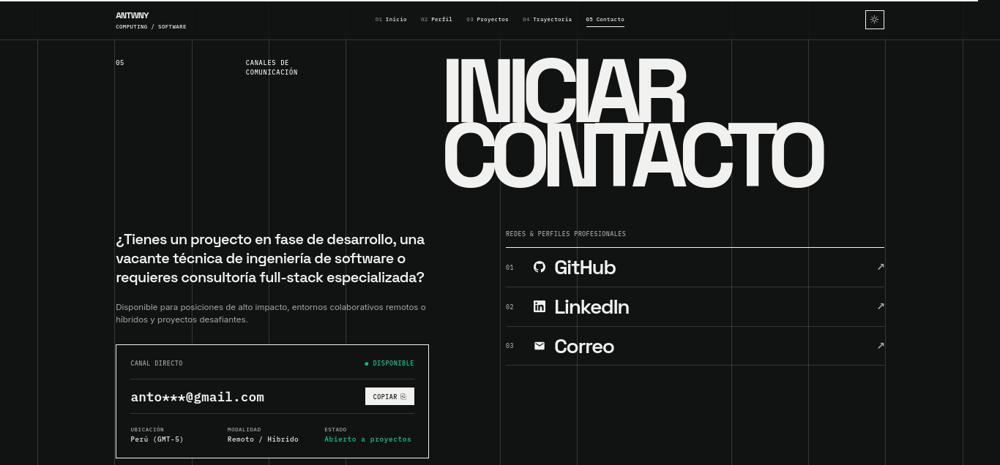

# Portafolio Web Personal 

> **Portafolio Brutalista Editorial de Alta Gama** diseñado y desarrollado con **Angular 19**, **TypeScript** y **CSS Grid** para presentar proyectos de ingeniería de software, arquitectura de sistemas y desarrollo full-stack.

[](https://angular.dev/)
[](https://www.typescriptlang.org/)
[](https://github.com/features/actions)
[](LICENSE)

🌐 **Demo en vivo:** [https://antwny.github.io/portafolio-v3/](https://antwny.github.io/portafolio-v3/)

---

## 📸 Vista Previa

| Modo Claro | Modo Oscuro |
| :---: | :---: |
|  |  |

---

## ✨ Características Principales

- **🏛️ Estética Brutalista Editorial**:
  - Tipografía display monumental con **Space Grotesk**, cuerpo legible en **Inter** y anotaciones técnicas en **IBM Plex Mono**.
  - Sistema de cuadrícula estricto de **12 columnas** con micro-interacciones fluidas.
- **🌗 Modo Oscuro / Claro**:
  - Conmutador instantáneo de temas con persistencia en `localStorage` y detección de preferencias del sistema operativo (`prefers-color-scheme`).
- **🖼️ Visor Lightbox de Capturas en Alta Resolución**:
  - Modal interactivo con navegación por miniaturas y soporte para atajos de teclado (`Esc`, `←`, `→`).
  - **Gestos táctiles (*Swipe*)** en dispositivos móviles y tablets.
  - **Placeholder / Skeleton Loader (*Shimmer*)** para conexiones de red lentas.
- **⚡ Arquitectura Reactiva con Angular Signals**:
  - Manejo de estado limpio mediante `signal` y `computed` (`activeFilter`, `filteredProjects`, `scrollProgress`, `activeModalProject`).
  - Componentes *Standalone* modulares y directivas personalizadas de revelación con `IntersectionObserver`.
- **🔍 SEO Técnico & PWA**:
  - Metadatos canónicos, OpenGraph y Twitter Cards (`summary_large_image`).
  - Datos estructurados **Schema.org (JSON-LD)** (`Person` y `WebSite`).
  - Favicon vectorial SVG adaptativo, `manifest.webmanifest`, `sitemap.xml` y `robots.txt`.
- **🤖 CI/CD Automatizado**:
  - Workflow de **GitHub Actions** para compilación y despliegue automático a GitHub Pages en cada push.

---

## 📂 Proyectos Destacados

1. **MAIDO SPRING (Full-Stack / E-Commerce)**
   - Java 21 · Spring Boot · MySQL · Thymeleaf · Tailwind CSS · MercadoPago SDK · JasperReports.
2. **PORTAL ANIQUEM (Plataforma Cloud / CRM)**
   - Java 21 · Spring Boot · Spring Data JPA · MySQL · JWT · Spring Security.
3. **STYLE STORE (E-Commerce / Frontend SPA)**
   - React · TypeScript · CSS Modules · Context API · Responsive Design.
4. **EN SU PUNTO (Full-Stack / HTMX & Spring)**
   - Java 21 · Spring Boot · HTMX 1.9 · Tailwind CSS · MySQL · JasperReports.
5. **MAIDO ASP.NET (Cloud ERP / MVC)**
   - C# · ASP.NET Core MVC · Entity Framework Core · SQL Server · QuestPDF · AJAX.
6. **PORTAFOLIO WEB V2 (Frontend / Angular 19)**
   - Angular 19 · TypeScript · CSS Grid · Signals · Web App Manifest · GitHub Actions.

---

## 🛠️ Stack Tecnológico

```
Frontend:     Angular 19 · React · TypeScript · HTML5 Semántico · CSS Grid / Flexbox
Backend:      Java 21 · Spring Boot · C# · ASP.NET Core MVC · Node.js · APIs RESTful
Bases de Datos: MySQL · MariaDB · SQL Server · Supabase
Herramientas: Linux (Arch / Bash) · Git & GitHub · JasperReports · QuestPDF · Vitest
```

---

## 🚀 Instalación y Uso Local

### Prerrequisitos

- [Node.js](https://nodejs.org/) v20+ o v22+
- [npm](https://www.npmjs.com/) v10+
- [Angular CLI](https://angular.dev/tools/cli) (opcional, incluido en `devDependencies`)

### 1. Clonar el repositorio

```bash
git clone https://github.com/antwny/portafolio-v3.git
cd portafolio-v3
```

### 2. Instalar dependencias

```bash
npm install
```

### 3. Iniciar servidor de desarrollo

```bash
npm start
# O bien: npx ng serve
```

Navega a `http://localhost:4200/`. La aplicación se recargará automáticamente al editar cualquier archivo.

### 4. Ejecutar pruebas unitarias

```bash
npm test
# O bien: npx ng test --watch=false
```

### 5. Compilar para producción

```bash
npm run build
# O bien: npx ng build --configuration production
```

Los artefactos listos para producción se generarán en la carpeta `dist/portfolio/browser/`.

---

## 📁 Estructura del Código

```
portfolio/
├── .github/workflows/
│   └── deploy.yml            # CI/CD automatizado para GitHub Pages
├── public/
│   ├── assets/projects/      # Capturas de pantalla por proyecto
│   ├── favicon.svg           # Favicon vectorial con modo claro/oscuro
│   ├── manifest.webmanifest  # Manifiesto PWA
│   ├── robots.txt            # Directivas para motores de búsqueda
│   └── sitemap.xml           # Mapa del sitio para SEO
├── src/
│   ├── app/
│   │   ├── about/            # 02 / Perfil y filosofía de ingeniería
│   │   ├── experience/       # 04 / Trayectoria y certificaciones
│   │   ├── hero/             # 01 / Portada con reloj local de Lima en vivo
│   │   ├── navbar/           # Navegación con barra de progreso de scroll y selector de tema
│   │   ├── projects/         # 03 / Galería de proyectos, filtros y visor modal
│   │   ├── social/           # 05 / Contacto directo, copiado de email y enlaces
│   │   ├── mock-data.ts      # Datos estructurados e interfaces TypeScript
│   │   └── reveal.directive.ts # Directiva de animaciones basada en IntersectionObserver
│   ├── index.html            # Metadatos SEO, OpenGraph, Twitter Cards y JSON-LD
│   ├── main.ts               # Punto de entrada de bootstrap standalone
│   └── styles.css            # Variables globales, temas y tipografía
└── angular.json              # Configuración y presupuestos del build
```

---

## 👤 Autor

**Antony A. Benites**
- **GitHub:** [@antwny](https://github.com/antwny)
- **LinkedIn:** [Antony Benites](https://www.linkedin.com/in/antony-benites)
- **Correo:** `anto***@gmail.com`

---

## 📄 Licencia

Este proyecto está bajo la Licencia MIT. Consulta el archivo [LICENSE](LICENSE) para más detalles.

